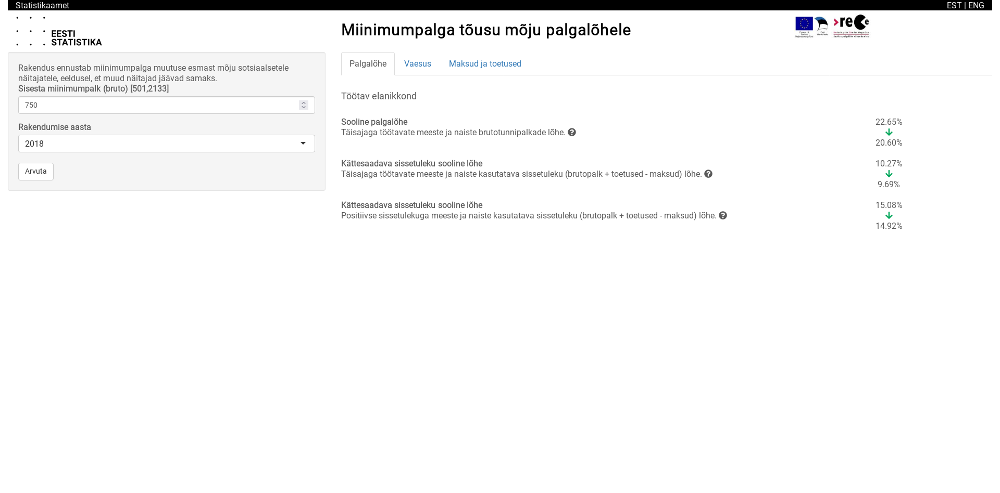
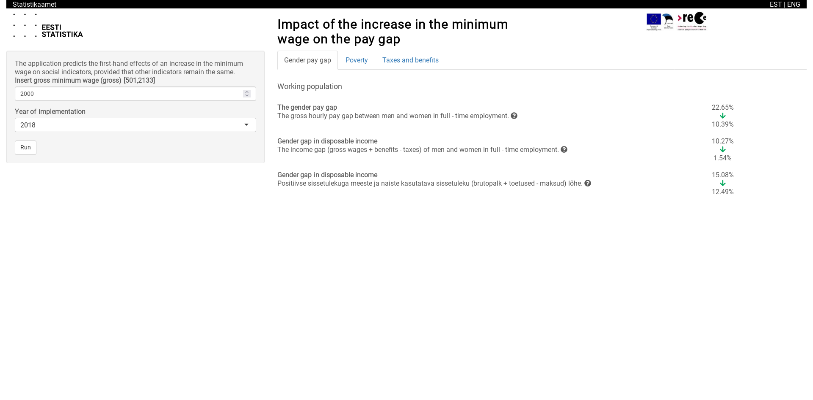

# euromod-web-interface
<!-- badges: start -->

<!-- badges: end -->
  
Web interface to run [EUROMOD](https://euromod-web.jrc.ec.europa.eu/) simulations.

Currently the interface remains disconnected from any live EUROMOD instance and
uses pre-computed data as its back-end.

## Code

This is a [shiny](https://shiny.rstudio.com/) 1.4.0 application with various
components (such as the the input side panel and the results tabs) of the
application divided into shiny modules. The project is structured in this
way (as an R package named `rege`) to help ease development and also because a contributor was
following [engineering-shiny](https://engineering-shiny.org/) at the time.

The code-base includes a [ComputedProvider](R/ComputedProvider.R) as a back-end of
sorts to serve as the interface between the main application and the pre-computed
data that it uses. This [R6](https://r6.r-lib.org/) class is structured and used
in a way that should make it easy to replace with another similar class that interfaces
directly with EUROMOD.

The code-base also uses a translator from [shiny.i18n](https://github.com/Appsilon/shiny.i18n)
translating all displayed text with the [translation file](inst/extdata/translation.json).

### Tests
Only the `ComputedProvider` has unit tests with the [testthat](https://testthat.r-lib.org/)
package as of now.

## Data
The data for the `ComputedProvider` is stored as R Data files in [data](data/) but
that data is itself derived for the csv files in [data-raw](data-raw). As the data
is derived from EUROMOD, it has its own license. The script to derive the csv files
from an EUROMOD instance is not included at this time.

## Development
This project was developed primarily with RStudio 2021.09.0 and R 4.0.5 on Ubuntu 20.04 but
it should be noted that the [data processing script](data-raw/processing.R) does
not work well with any OS other than Windows because the raw csv data files were
created on a Windows machine with some Windows specific encoding.

The project was bootstrapped with [golem](https://github.com/ThinkR-open/golem)
but all dependencies on golem had to be removed because (as of the time the project was in development) the golem package is quite large
and imported a bunch of other packages that were not necessary for execution. The
[dev scripts](dev/) still contains references to golem and [usethis](https://usethis.r-lib.org/)
as they may be re-introduced as soft dependencies in the future.

## Setup and Deployment
The project uses [renv](https://rstudio.github.io/renv/) so all relevant packages
can be restored from the lock file. The project's direct dependencies are also
listed in the [DESCRIPTION](DESCRIPTION).

Locally, the project can be opened using RStudio and the dependencies restored with
`rege::restore()`, then the project built using Rstudio's build command (Build > Install and Restart)
. With the project built and installed, the application can be run with `rege::run_app`.

The [latest rsconnect deployment file](rsconnect/shinyapps.io/oluwandabira/ewi-beta.dcf)
is the <https://www.shinyapps.io/> deployment file for the [development beta build](https://oluwandabira.shinyapps.io/ewi-beta/).

## Screenshots

